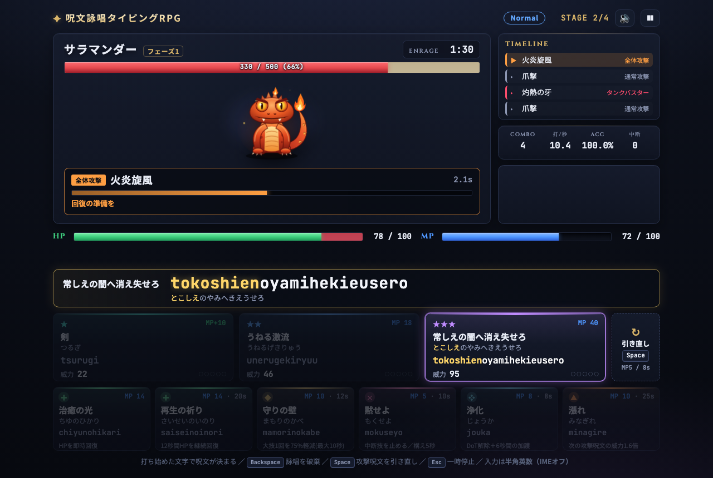
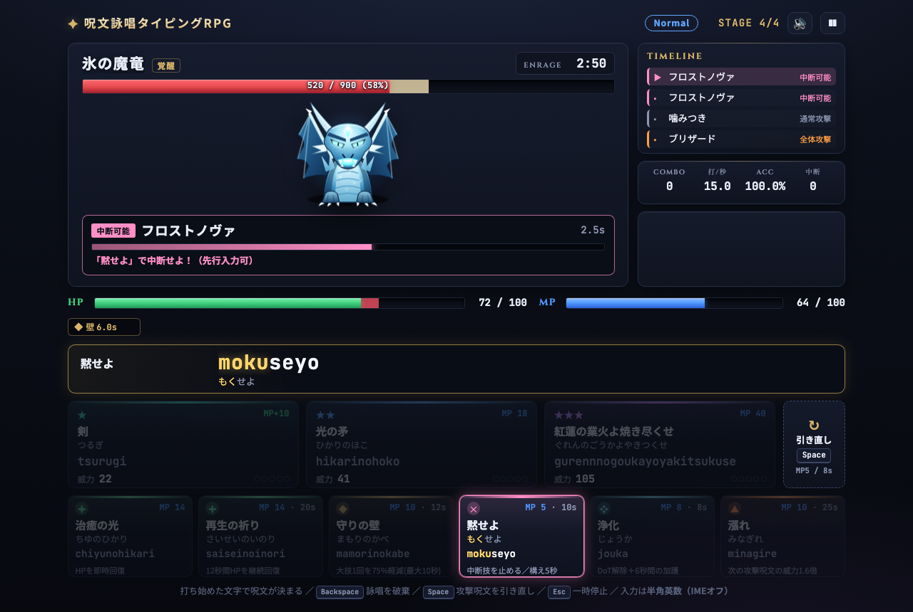
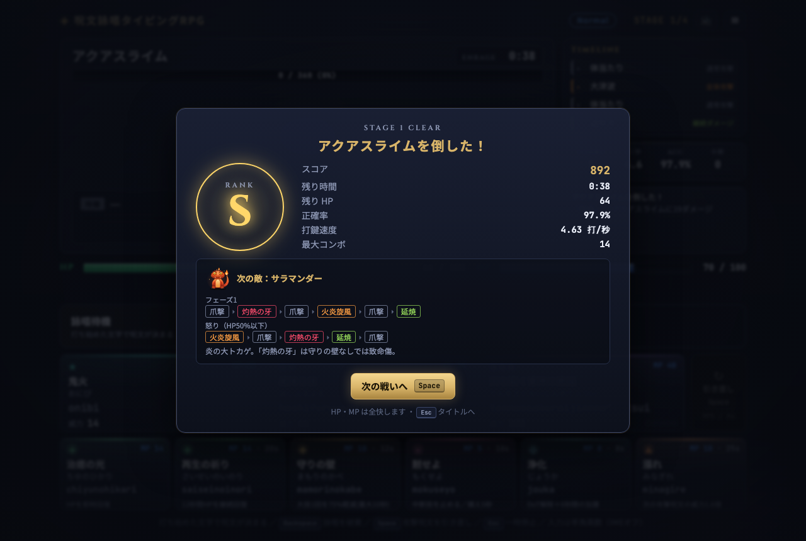

# 呪文詠唱タイピングRPG

呪文をローマ字で「詠唱（タイピング）」し、ボスの技に対応しながら戦うブラウザ用タイピングRPGです。
FF14 のボス戦のように、敵の詠唱バーを見て「今何を唱えるべきか」を判断するのが肝です。
ビルド不要・依存ゼロの静的サイトで、画像・音声ファイルも使っていません（ボスは SVG、BGM と効果音は WebAudio で生成）。



| タイトル | ボスの詠唱 | リザルト |
| --- | --- | --- |
|  |  |  |

## 遊び方

1. `index.html` をブラウザで直接開く（GitHub Pages などに置いてもそのまま動きます）
2. 入力を **半角英数（IMEオフ）** にし、`←` `→` / `1`〜`4` で難易度を選んで `Space` で開始（`H` で遊び方、`S` で設定）
3. 手札の呪文をローマ字で打ち始める。打った文字に合う呪文だけが残り、打ち切ると発動
4. 4体のボスを順に倒せばクリア。負けたら `Space` でその敵に再挑戦、`Esc` でタイトルへ

撃破するたびに残り時間・残りHP・正確率から **S〜C のランク**が付き、全面クリアで通しのスコア（再挑戦 1 回につき -100 点）が出ます。難易度ごとのベスト記録はブラウザ（localStorage）に保存され、タイトル画面に表示されます。

入力中の呪文は、手札の上の**詠唱ライン**に大きく表示されます（打った部分が金色）。

| 操作 | キー |
| --- | --- |
| 詠唱 | ローマ字入力（`shi`/`si`、`chi`/`ti`、`nn`/`n'`、`kka`/`xtuka` などの揺れに対応） |
| 詠唱を破棄 | `Backspace` |
| 攻撃呪文を引き直す | `Space`（MP 5・リキャスト 8 秒） |
| 一時停止メニュー | `Esc`（再開・やり直し・遊び方・設定・タイトルへ）。ウィンドウを離れても自動で一時停止 |
| 決定・次へ（戦闘外） | `Space` / `Enter` |

設定では全体・BGM・効果音の音量、ミュート、画面の揺れ、演出を控えめにする（OS の「視差効果を減らす」が既定値）を変えられます。画面は 1080px 幅の固定レイアウトをウィンドウに合わせて拡大縮小します。

操作キーは左手小指を避けて、親指（Space）と右手（Backspace）に寄せています。

## 呪文の役割

上段の攻撃呪文 3 枚は使うたびに入れ替わり、下段の支援呪文 6 枚は常に並びます（リキャストあり）。

| 呪文 | 役割 | MP | リキャスト |
| --- | --- | --- | --- |
| ★ 攻撃（10 語：火の粉、熱風、鬼火 など） | 短い攻撃。**MP を 10 回復** | 0 | - |
| ★★ 攻撃（8 語：命の焔、星降る夜 など） | 中程度の攻撃 | 18 | - |
| ★★★ 攻撃（7 語：冥府の門よ今開け など） | 高威力だが MP を大きく消費。詠唱も長い | 40 | - |
| 治癒の光 | HP を即時 30 回復 | 14 | - |
| 再生の祈り | 12 秒間 HP を毎秒 4 回復（リジェネ） | 14 | 20s |
| 守りの壁（まもりのかべ） | 次の大技 1 回を 75% 軽減（最大 10 秒）。通常攻撃では消えない | 10 | 12s |
| 黙せよ（もくせよ） | 敵の「中断可能」技の詠唱を止める。対象がいないときに唱えると 5 秒間「構え」、その間に始まった中断可能技を即座に止める | 5 | 10s |
| 浄化（じょうか） | 継続ダメージを解除し、6 秒間の「加護」で次の継続ダメージ付与を無効化（着弾前の先行入力が有効） | 8 | 8s |
| 漲れ（みなぎれ） | 次の攻撃呪文の威力 1.6 倍 | 10 | 25s |

- **攻撃手札（★ / ★★ / ★★★ の3枠）**:
  - **風化**: 使われないまま他の呪文を 5 回唱えると、そのカードは風化して別の呪文に入れ替わる。残り回数はカード右下の ●○ で表示され、残り少なくなると色あせてひびが入る
  - **差別化は長さだけ**: 威力と MP は呪文の長さ（打鍵数）で決まる。属性はない
  - **ドローの偏り**: 手札に MP が足りて撃てる攻撃が他にないときは、撃てるカードが出やすくなる（確定ではない）。手札の他の呪文と頭のかなが同じものは出にくい（打ち始めで候補が絞れるように）
  - **MP 不足時**: ★★★枠は MP が 40 未満のとき半分の確率で★★が来る。MP 不足やリキャスト中のカードはグレーアウトする
  - **引き直し**: `Space`（または右端の ↻）で攻撃3枠をまとめて引き直せる。詠唱中の呪文は破棄される
- **MP 循環**: ★で MP を貯めて★★★を撃つ。★★★だけを連打するとすぐ MP が尽きる
- **被弾しても詠唱には影響しない**: 入力中の文字列・進捗・ハイライト・威力はそのまま。長い呪文のリスクは MP・時間切れ・防御が着弾に間に合うかで決まる
- **ミスタイプ**: 詠唱中のミス 1 回につき威力 -10%（下限 40%）。ノーミス詠唱を続けるとコンボで威力アップ（最大 +50%）

## ボスのギミック

ボスは詠唱バーに技名と種類を表示してから技を放ちます。技は敵ごとの**タイムライン**（決まった順番）で繰り返され、HP が減ると**フェーズ**が変わって技の並びが変わります。撃破・敗北画面で次の敵（現在の敵）のタイムラインを確認できます。

| 種類      | 内容                         | 対応                               |
| ------- | -------------------------- | -------------------------------- |
| 通常攻撃    | 小ダメージ                      | —                                |
| 全体攻撃    | 大ダメージ（即死ではない）。壁があれば消費して軽減  | 事前・事後に回復                         |
| タンクバスター | 壁なしでは**ほぼ即死**              | 着弾前に「守りの壁」（直前の全体攻撃で消費されないよう注意）   |
| 中断可能    | 失敗すると大ダメージ＋被ダメージ 1.5 倍のデバフ | 詠唱中に「黙せよ」、または事前に構える              |
| 継続ダメージ  | 毒などで HP が減り続ける             | 着弾前の「浄化」（加護）で防ぐ／付いた後に解除（耐える判断も可） |
| 時間切れ    | ENRAGE が 0 になると全滅技「終焉」     | 守りに偏らず火力を出す                      |

画面右の **TIMELINE** に、詠唱中の技と次の技が並びます（Hard 以上は次の技が「？？？」）。敵ごとの個性は属性ではなく、このタイムラインとギミックの組み合わせで出しています。

HP の自然回復はなく、回復呪文なしでは中盤以降を越えられません。

## 難易度

`js/data.js` の `DIFFICULTIES` で一括管理しています。

| 難易度 | 敵の詠唱時間 | 被ダメージ | 時間制限 | 敵HP | MP回復/秒 | その他 |
| --- | --- | --- | --- | --- | --- | --- |
| Easy | ×1.4 | ×0.5 | ×1.6 | ×0.7 | 2.0 | 一部ギミックなし |
| Normal | ×1.0 | ×1.0 | ×1.0 | ×1.0 | 1.3 | |
| Hard | ×0.85 | ×1.2 | ×0.95 | ×1.0 | 1.1 | 次の技が表示されない・ギミック追加 |
| Savage | ×0.8 | ×1.22 | ×0.85 | ×1.2 | 1.0 | さらにギミック追加 |

タイムラインの `'技名@N'` は難易度レベル N 以上でのみ使われます（Easy=0 〜 Savage=3）。

### 打鍵速度の目安

ギミックに適切に対応する bot（proper）の打鍵速度を振り、全4面を**再挑戦なしで**通せる確率が 50% / 80% になる速度を求めました（`node tools/speed.mjs 80 0.05`、ミス率 5%、各速度 80 回）。タイトル画面の難易度ボタンにも小さく表示しています。

| 難易度 | 50% クリア | 80% クリア | e-typing WPM 相当（50%〜80%） |
| --- | --- | --- | --- |
| Easy | 1.7 打/秒 | 1.9 打/秒 | 約 100〜115 |
| Normal | 4.1 打/秒 | 4.3 打/秒 | 約 245〜260 |
| Hard | 5.6 打/秒 | 6.2 打/秒 | 約 335〜370 |
| Savage | 7.6 打/秒 | 8.7 打/秒 | 約 455〜525 |

- **打/秒**は「正しく打てたキー数 ÷ 時間」です。寿司打の結果画面の「平均キータイプ数（回/秒）」と同じ定義なので、そのまま比べられます。bot はミスタイプ 1 回にも 1 打ぶんの時間を使うので、bot の押下速度 ÷ 1.05 で換算しています。
- **e-typing の WPM** は「1 分間に入力した文字数（ローマ字のキー数）」なので、打/秒 × 60 で換算しています。
- bot は呪文を選ぶたびに 0.3 秒の判断時間を取ります。寿司打の平均キータイプ数もお題の切り替わりの時間を含むので、条件は近いですが、ボスの技への対応を判断する時間はこのゲーム特有です。目安より少し速い人が同じ確率でクリアできる、くらいに見てください。
- ミスの少ない人は目安より遅くてもクリアできます（ミス率 2% なら目安より 0.1〜1.1 打/秒ほど遅くても同じ確率。難易度が高いほど差が大きい）。

## 語彙と指の負荷

攻撃呪文は 25 語（★10 / ★★8 / ★★★7）。左手小指の疲労を減らすため、あ段の多い語と `z` を含む語を避け、支援呪文は意味が直感的に伝わることを優先しています（守りの壁・黙せよ・浄化・漲れ）。`node tools/finger-load.mjs` で、推奨ローマ字の指別打鍵割合を集計できます（タッチタイピングの標準的な指の割り当て）。

| | 左小指 | 左薬指 | 左中指 | 左人差指 | 右人差指 | 右中指 | 右薬指 | 右小指 |
| --- | --- | --- | --- | --- | --- | --- | --- | --- |
| 変更前（実プレイ相当） | 14.9% | 4.3% | 7.6% | 13.3% | 29.6% | 18.0% | 12.3% | 0.0% |
| 変更後（実プレイ相当） | 6.0% | 4.0% | 6.7% | 13.6% | 30.2% | 23.9% | 14.0% | 1.6% |

「実プレイ相当」は Normal で proper bot が実際に正しく打ったキー（約 1 万打）の集計です。母音に占める `a` は 18.3% → 11.7%、`z` は 230 打 → 0 打になりました。

## 構成

```
index.html            画面（OGP・favicon を含む）
style.css             スタイル（各領域を固定サイズにしてレイアウトシフトを防止）
sprites.css           ボスの待機アニメーションと状態（怒り・フェーズ）の演出
favicon.svg / og.png  アイコンと SNS 共有用の画像
js/romaji.js          ローマ字入力エンジン（複数綴り対応・入力済み/残りの表示）
js/battle.js          戦闘計算（威力・ミス/コンボ・MP・被ダメージ）
js/data.js            難易度・呪文・敵とタイムラインのデータ
js/engine.js          戦闘エンジン（DOM 非依存。tick(ms) と key(ch) で進行）
js/sfx.js             WebAudio による BGM（5 曲）と効果音の生成・ミキサー
js/sprites.js         ボスの SVG イラスト
js/game.js            描画・画面遷移・キー入力・設定と記録の保存
tools/bots.mjs        バランス検証用の自動プレイ bot
tools/simulate.mjs    難易度 × bot の勝率表を出力
tools/speed.mjs       打鍵速度を振って難易度ごとの目安速度（クリア率 50%/80%）を求める
tools/hand-stats.mjs  手札の質（撃てる攻撃カードの枚数・滞留回数）を計測
tools/finger-load.mjs 呪文の推奨ローマ字の指別打鍵負荷を集計
tests/*.test.mjs      node:test によるテスト
screenshots/          画面のスクリーンショット
.github/workflows/    テスト後に GitHub Pages へ公開するワークフロー
```

## 公開（GitHub Pages）

`main` に push すると `.github/workflows/pages.yml` がテストを実行し、ゲームに必要なファイルだけ（`tests/` `tools/` は除く）を GitHub Pages に公開します。初回はリポジトリの Settings → Pages → Source を **GitHub Actions** にしてください。`index.html` の `og:image` / `og:url` は `https://masaki39.github.io/typing-rpg/` を前提にしているので、公開先が違う場合は書き換えてください。

`romaji.js` / `battle.js` / `data.js` / `engine.js` は DOM 非依存で、ブラウザではグローバル変数、Node では `require` で読み込めます（`file://` で開けるよう ES Modules は使っていません）。

## テスト・バランス検証

```sh
node --test                 # または pnpm test
node tools/simulate.mjs 20  # または pnpm simulate 20（各条件 20 回ずつ）
node tools/hand-stats.mjs 20 normal proper  # 手札の質
node tools/speed.mjs 80 0.05                # 打鍵速度の目安（試行回数・ミス率）
node tools/finger-load.mjs                  # 指別の打鍵負荷
```

bot は次の 4 種類です。

- `greedy`: ★★★攻撃だけを打ち続ける（5 打/秒）
- `proper`: ギミックに対応する。壁・黙せよ・浄化は先行入力し、次の大技に耐えられる HP を保つ。撃てる攻撃がなければ引き直す（4.5 打/秒、ミス 3%）
- `sloppy`: 中断・浄化を使わず回復も遅い（3.5 打/秒、ミス 8%）
- `expert`: proper と同じ判断で速い（6.5 打/秒、ミス 2%）

Node.js 20 以上。依存パッケージはありません。画面の Web フォント（Noto Sans JP / JetBrains Mono / Cinzel）は Google Fonts から読み込みますが、オフラインでもシステムフォントで同じレイアウトに収まります。
